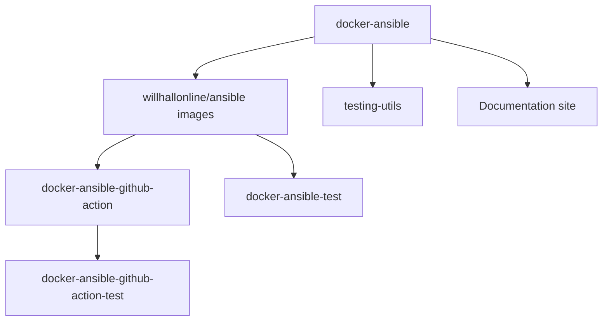

# Projects

The willhallonline Docker Ansible ecosystem is a small set of repositories for
running Ansible consistently from Docker containers and CI workflows.

At the centre is the `willhallonline/ansible` image family. The related projects
provide a GitHub Action wrapper, test repositories, and reusable test utilities.

!!! note "Repository ownership"
    The core images are maintained by Will Hall and published from the
    [`willhallonline/docker-ansible`](https://github.com/willhallonline/docker-ansible)
    repository.

## Ecosystem map

| Project | Repository | Purpose |
| --- | --- | --- |
| Docker Ansible | [`willhallonline/docker-ansible`](https://github.com/willhallonline/docker-ansible) | Builds Ansible Docker images for Alpine, Ubuntu, Rocky Linux, and Debian with multiple supported Ansible versions. |
| Docker Hub image | [`willhallonline/ansible`](https://hub.docker.com/r/willhallonline/ansible) | Published container images containing `ansible-core`, `ansible`, and `ansible-lint`. |
| GitHub Action | [`willhallonline/docker-ansible-github-action`](https://github.com/willhallonline/docker-ansible-github-action) | Docker-based GitHub Action for running Ansible from the image family. |
| Image testing | [`willhallonline/docker-ansible-test`](https://github.com/willhallonline/docker-ansible-test) | Test repository used to exercise the Docker Ansible images. |
| Action testing | [`willhallonline/docker-ansible-github-action-test`](https://github.com/willhallonline/docker-ansible-github-action-test) | Test repository used to exercise the Docker Ansible GitHub Action. |
| Test utilities | [`testing-utils/`](https://github.com/willhallonline/docker-ansible/tree/main/testing-utils) | Helper files and scripts used by the core image test workflows. |
| Project website | [`docker-ansible/docker-ansible.github.io`](https://github.com/docker-ansible/docker-ansible.github.io) | MkDocs Material documentation site for the ecosystem. |

## How the repositories fit together



The core repository builds the images. The GitHub Action consumes those images.
The test repositories verify that common image and action workflows keep working.

## Core image family

The Docker Hub image is published as:

```text
willhallonline/ansible
```

Images are built across several base operating systems and Ansible versions.
Current Ansible versions include:

- `2.16.14`
- `2.17.14`
- `2.18.9`
- `2.19.2`
- `2.20.0`
- `2.21.0`

!!! tip "Pin your runtime"
    Use an explicit Ansible-version and base-OS tag for repeatable automation.
    See the image tag reference when choosing production tags.

## Common user journeys

| If you want to... | Start with... |
| --- | --- |
| Run Ansible locally without installing Python packages on your host | [`docker-ansible.md`](docker-ansible.md) |
| Run a playbook in GitHub Actions | [`github-action.md`](github-action.md) |
| Check that an image works in your environment | [`testing.md`](testing.md) |
| Decide which image tag to use | [`../reference/faq.md`](../reference/faq.md) |
| Diagnose Docker or Ansible runtime errors | [`../reference/troubleshooting.md`](../reference/troubleshooting.md) |
| Harden CI and image usage | [`../reference/security.md`](../reference/security.md) |

## Maintainer

The ecosystem is maintained by
[Will Hall](https://www.willhallonline.co.uk).

## Project pages

- [Docker Ansible](docker-ansible.md)
- [Docker Ansible GitHub Action](github-action.md)
- [Testing](testing.md)
